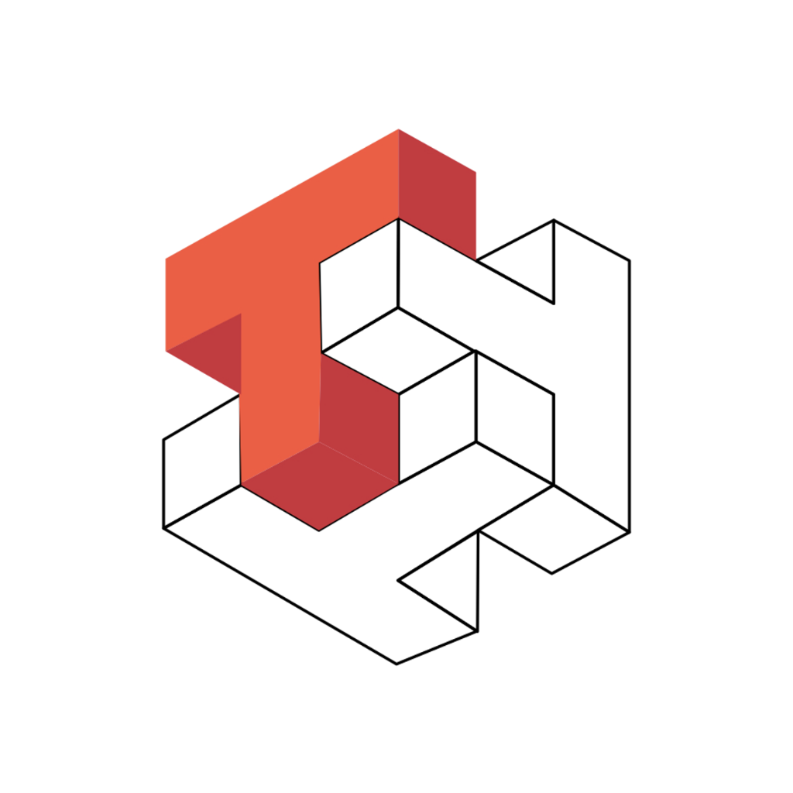

<div align="center">

# CMJ Family

**Empowering Innovation • Engineering Excellence • Legacy of Giving**

[](https://github.com/cmjcode)
[](https://github.com/cmjcode)
[](https://ngatiyem.org/)
[](https://opensource.org/licenses/MIT)

<br/>

> *Crafted with precision by the Jayuda family. Delivering commercial-grade, open-source software inspired by a legacy of selfless giving and community empowerment.*

<br/>

</div>

---

## 🌟 Our Mission & Legacy

**CMJ Family** serves as the central hub for software engineering initiatives, open-source tools, and high-performance applications developed by the Jayuda family.

Our engineering journey is rooted in carrying forward the lifelong mission and principles of **Ibu Ngatiyem**, who devoted her life to uplifting communities, helping others unconditionally, and creating lasting positive impact. We channel that spirit of service into modern technology: **building enterprise-grade, polished, and high-performance software that remains 100% free and accessible to everyone.**

<div align="center">

| 🌐 Philanthropic Initiatives | 📍 Physical Basecamp |
| :--- | :--- |
| **Online:** [ngatiyem.org](https://ngatiyem.org/) | **Location:** [Joglo Ngatiyem (Google Maps)](https://maps.app.goo.gl/AYwJqXZjUyBA9S396/) |

</div>

---

## 💡 Core Engineering Pillars

```
┌───────────────────────────┐      ┌───────────────────────────┐
│     LEGACY OF IMPACT      │      │ PRODUCTION-GRADE SYSTEMS  │
│ Purpose-driven technology │      │ Resilient, scalable, and  │
│  solving real problems    │      │ cleanly engineered code   │
└─────────────┬─────────────┘      └─────────────┬─────────────┘
              │                                  │
              ▼                                  ▼
┌───────────────────────────┐      ┌───────────────────────────┐
│     COMMERCIAL POLISH     │      │    100% FREE & OPEN       │
│ Intuitive UX/UI & robust  │      │ Transparent & accessible  │
│   documentation standards │      │ to learners & creators    │
└───────────────────────────┘      └───────────────────────────┘
```

- **🎯 Legacy of Impact:** Technology engineered with purpose—designed to empower developers, organizations, and creators worldwide.
- **⚡ Production-Grade Architecture:** Modular codebases, strict typing, high test coverage, and enterprise-ready reliability.
- **✨ Commercial Polish:** Polished interfaces, seamless user workflows, modern design systems, and comprehensive documentation out of the box.
- **🔓 100% Free & Open:** Unrestricted access for self-hosting, personal learning, and collaborative open-source advancement.

---

## 🚀 Featured Projects

Discover our flagship open-source software:

<table align="center" width="100%">
  <tr>
    <td width="50%" valign="top" align="center">
      <br/>
      <a href="https://github.com/cmjcode/tabular">
        
      </a>
      <h3><a href="https://github.com/cmjcode/tabular">Tabular</a></h3>
      <p align="center">
        <a href="https://github.com/cmjcode/tabular"></a>
        
      </p>
      <p align="left">
        <strong>High-performance tabular data tool and engine.</strong> Engineered to streamline large-scale dataset management, robust data transformations, and high-throughput data processing workflows with commercial-grade speed and reliability.
      </p>
      <ul align="left">
        <li>⚡ Ultra-fast processing engine</li>
        <li>📊 Versatile spreadsheet & data grid workflows</li>
        <li>🛠️ Production-ready developer APIs</li>
      </ul>
      <p align="center">
        <a href="https://github.com/cmjcode/tabular"><strong>Explore Tabular Repository →</strong></a>
      </p>
    </td>
    <td width="50%" valign="top" align="center">
      <br/>
      <a href="https://github.com/cmjcode/ducad">
        
      </a>
      <h3><a href="https://github.com/cmjcode/ducad">Ducad</a></h3>
      <p align="center">
        <a href="https://github.com/cmjcode/ducad"></a>
        
      </p>
      <p align="left">
        <strong>Commercial-grade CAD and design engine.</strong> Crafted for high precision, intuitive vector editing, parametric modeling, and open engineering collaboration without proprietary lock-in.
      </p>
      <ul align="left">
        <li>📐 High-precision 2D/3D design engine</li>
        <li>🎨 Modern, intuitive CAD interface</li>
        <li>🌐 Collaborative & open standards compliant</li>
      </ul>
      <p align="center">
        <a href="https://github.com/cmjcode/ducad"><strong>Explore Ducad Repository →</strong></a>
      </p>
    </td>
  </tr>
</table>

---

## 🤝 Contributing & Community

We believe in the power of open collaboration. Whether you are fixing a bug, suggesting a feature, improving documentation, or adding tests—your contributions are warmly welcomed!

```bash
# 1. Fork the target repository
# 2. Clone your fork locally
git clone https://github.com/YOUR_USERNAME/PROJECT_NAME.git

# 3. Create a dedicated feature branch
git checkout -b feature/awesome-enhancement

# 4. Commit your structured changes
git commit -m "feat: introduce awesome enhancement"

# 5. Push to your branch and open a Pull Request
git push origin feature/awesome-enhancement
```

> Please ensure your pull requests adhere to clean code standards, include appropriate unit/integration tests, and follow our commit conventions.

---

## 📬 Connect & Governance

<div align="center">

| Organization | Community & Basecamp | Licensing |
| :---: | :---: | :---: |
| **GitHub:** [@cmjcode](https://github.com/cmjcode) | **Philanthropy:** [ngatiyem.org](https://ngatiyem.org/)<br/>**Basecamp:** [Joglo Ngatiyem](https://maps.app.goo.gl/AYwJqXZjUyBA9S396/) | **Open Source:** [MIT License](LICENSE) |

<br/>

<sub>© 2026 CMJ Family • Crafted with heart and dedication in honor of Ibu Ngatiyem</sub>

</div>
